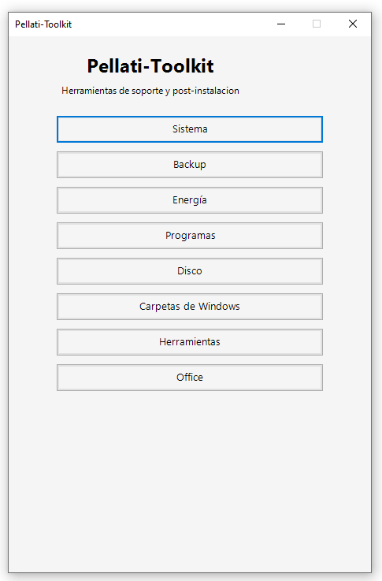
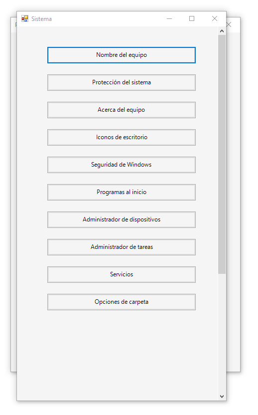
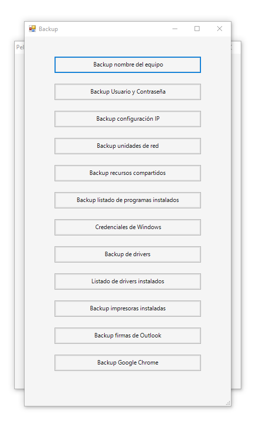
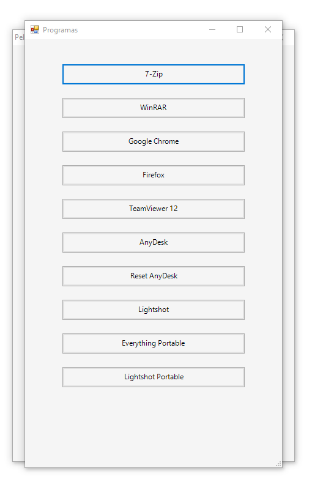
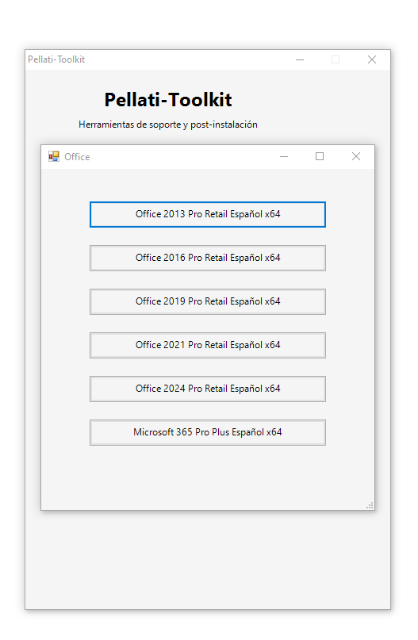

# Pellati-Toolkit


Toolkit personal de soporte técnico y post-instalación para Windows desarrollado en PowerShell y Windows Forms.

---

# Instalación rápida

Abrí **Windows PowerShell** como administrador y ejecutá:

```powershell
irm https://raw.githubusercontent.com/santicastelar/Pellati-Toolkit/main/install.ps1 | iex
```

El instalador descargará automáticamente la **última versión estable** desde GitHub Releases y ejecutará Pellati-Toolkit.

---

# Instalación manual

1. Ir a la sección **Releases** del repositorio.
2. Descargar la última versión disponible.
3. Extraer el archivo ZIP.
4. Ejecutar **Pellati-Toolkit.exe** como administrador.

---

# Capturas de pantalla

## Menú principal



## Sistema



## Backup



## Programas



## Carpetas de Windows



---

# Módulos

## Sistema

- Nombre del equipo
- Protección del sistema
- Acerca del equipo
- Iconos de escritorio
- Seguridad de Windows
- Programas al inicio
- Administrador de dispositivos
- Administrador de tareas
- Servicios
- Opciones de carpeta

## Backup

- Backup del nombre del equipo
- Backup de usuario y contraseña
- Backup de configuración IP
- Backup de unidades de red
- Backup de recursos compartidos
- Backup del listado de programas instalados
- Acceso a Credenciales de Windows

## Energía

- Configuración automática para soporte técnico.
- Acceso al plan de energía de Windows.

## Programas

- Instalación rápida de software de uso frecuente.

## Disco

- Herramientas de administración de discos.

## Carpetas de Windows

- Acceso rápido a carpetas del sistema.

## Herramientas

- Utilidades de soporte técnico.

## Office

- Instalación de distintas versiones de Microsoft Office.

---

# Características

- Aplicación portable.
- Instalación automática mediante PowerShell.
- Actualización sencilla mediante GitHub Releases.
- Ejecutable compilado con PS2EXE.
- Compatible con Windows 10 y Windows 11.
- Requiere permisos de administrador.
- Arquitectura modular.

---

# Tecnologías

- PowerShell 5.1
- Windows Forms
- PS2EXE
- Git
- GitHub

---

# Hoja de ruta

Próximas funciones planificadas:

- Impresoras.
- Windows Update.
- Limpieza de Windows.
- Diagnóstico SMART.
- Actualización automática desde GitHub.
- Más herramientas de soporte técnico.

---

# Licencia

Proyecto personal desarrollado con fines educativos y de soporte técnico.